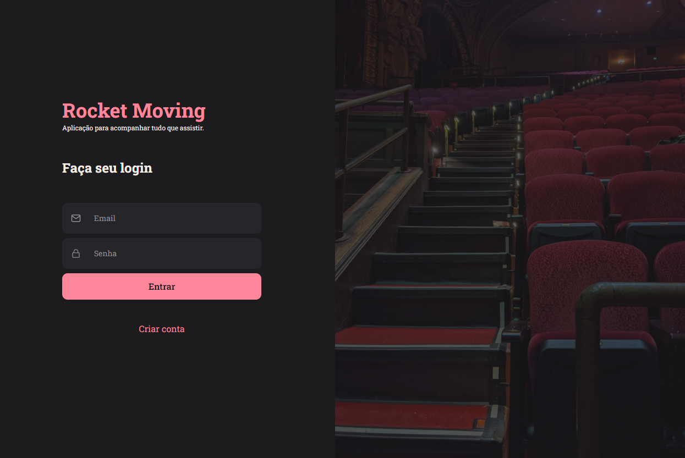

# rocketmovies
## Desafio 02 do nível 09 - rocketmovies front end em react.js

## :dart:  Desafio

A ideia agora é criar o front end de uma aplicação em REACT.js onde o usuário cadastra um filme, preenche com algumas informações (nome, descrição, nota) e cria tags relacionadas a ele.

## Resumo do que foi feito e o que aprendi
- Foram criadas as interfaces da aplicação RocketMoving todo em react.js 
- Componentização de elementos
- Vite
- React DOM
- Router   
- Map
- Fragment
- CSS dentro de Javascript
- Temas Globais e Temas Individuais

## Principais pontos abordados

- Analisar projeto no Figma 

- REACT.JS

## :mailbox_closed: Contatos

> Email - rosendc30@gmail.com

> Linkedin - https://www.linkedin.com/in/francisco-rosendo-coelho/# gitfavorites